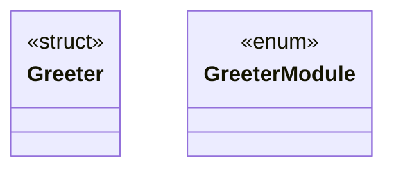

# Greeter — class diagram

Generated by Coast from the code (D6b) — do not edit. Regenerated deterministically at every S12 run; agents never write this file.

```mermaid
classDiagram
    class Greeter {
        <<struct>>
    }
    class GreeterModule {
        <<enum>>
    }
```
