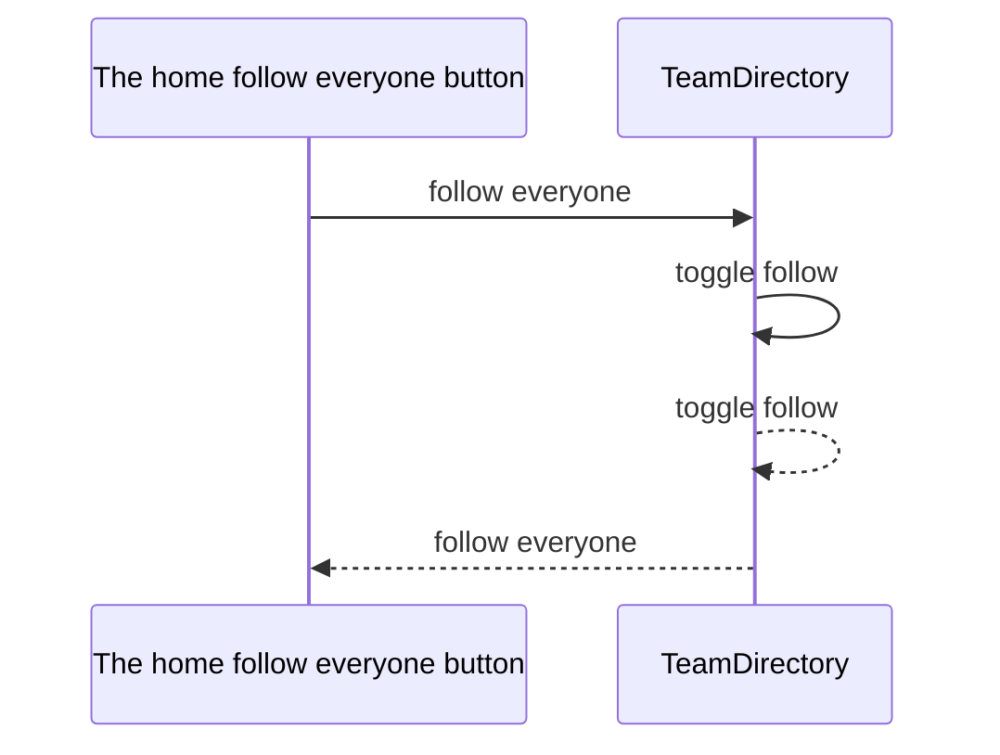

<!-- Generated by Coast from the code — do not edit by hand. -->

# Follow everyone

## Ways in

- The home follow everyone button (HomeView)

## The story

## Each arrow, both ways of saying it

- The home follow everyone button asks TeamDirectory to follow everyone.
  `public func followEveryone() -> Int`
- TeamDirectory asks TeamDirectory to toggle follow.
  `public func toggleFollow(id: String) -> Bool?`
- TeamDirectory hands its answer back to TeamDirectory.
  `public func toggleFollow(id: String) -> Bool?`
- TeamDirectory hands its answer back to The home follow everyone button.
  `public func followEveryone() -> Int`
