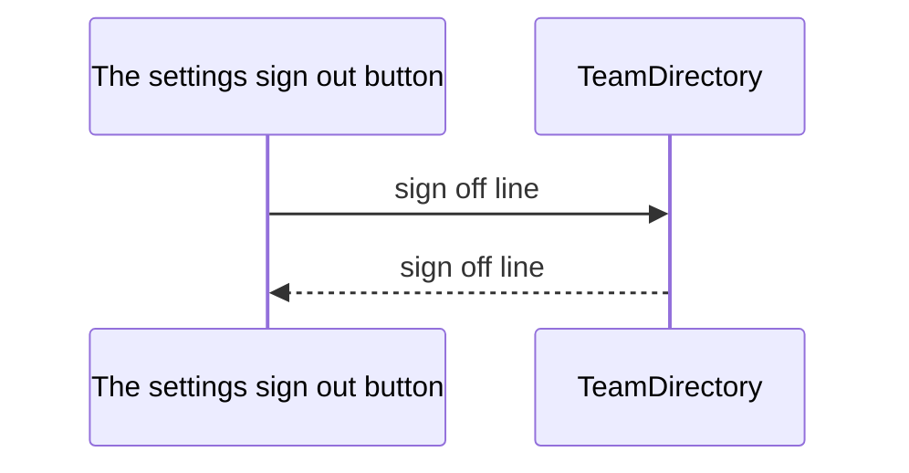

<!-- Generated by Coast from the code — do not edit by hand. -->

# Sign off line

## Ways in

- The settings sign out button (SettingsView)

## The story

## Each arrow, both ways of saying it

- The settings sign out button asks TeamDirectory to sign off line.
  `public func signOffLine(reader: String) -> String`
- TeamDirectory hands its answer back to The settings sign out button.
  `public func signOffLine(reader: String) -> String`
