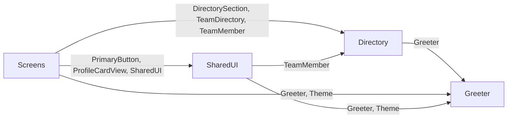

# Data flow

Generated by Coast from the code (D110) — do not edit. Regenerated deterministically at every check; agents never write this file.

- **Directory** — The three groupings the home screen offers.
- **Greeter** — A simple, stateless formatter that produces greeting strings.
- **Screens** — The directory's home screen: the greeting, the section picker, and one card per member.
- **SharedUI** — The one filled action button every screen uses.
- **Outside world**: nothing — everything happens on this device.
