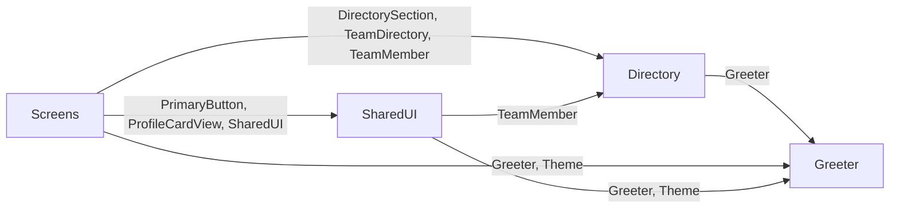

# System map

Generated by Coast from the code (D110) — do not edit. Regenerated deterministically at every check; agents never write this file.

| Module | One job |
|---|---|
| [Directory](../Directory.md) | The three groupings the home screen offers. |
| [Greeter](../Greeter.md) | A simple, stateless formatter that produces greeting strings. |
| [Screens](../Screens.md) | The directory's home screen: the greeting, the section picker, and one card per member. |
| [SharedUI](../SharedUI.md) | The one filled action button every screen uses. |
